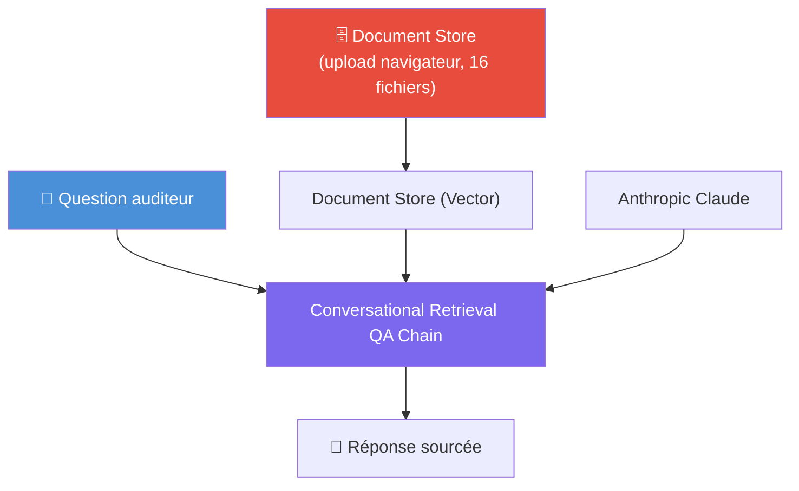

# J7 — Fiche projet A : Assistant multi-établissements (RAG)

**Public** : groupe de projet J7 — Product Build.
**Durée cadrée** : 3h de prototypage max.
**Type de flow** : Chatflow (RAG), sur le modèle de J3/J4-Agent-RAG.

---

## Contexte métier

Un auditeur travaille rarement sur un seul établissement. Il doit pouvoir interroger d'un coup l'ensemble des données de paie de plusieurs établissements d'un même groupe : repérer les valeurs extrêmes, comparer deux sites, retrouver un salarié précis sans savoir dans quel fichier il se trouve.

## Objectif

Construire un assistant RAG capable de répondre à des questions transverses sur les journaux de paie de plusieurs établissements, en citant des valeurs réelles (montants, matricules, noms d'établissement) — pas des réponses génériques.

## Données

16 journaux de paie (`Journal de paie - <établissement>.csv`), un par établissement, décimales à la virgule.

> ⚠️ **Important** : les fichiers Deloitte d'origine sont délimités par `|`. Le loader CSV de Flowise 3.1.2 n'expose **aucune option de délimiteur** dans l'interface (vérifié dans le code du produit) — avec le fichier brut, chaque ligne est indexée comme un seul champ non structuré, inexploitable pour une extraction fiable de valeur. **Les apprenants doivent recevoir la version pré-convertie** (`data/from_deloitte/converted_for_flowise/`, mêmes 16 fichiers, ré-encodés en CSV `,`-délimité correctement quoté, aucune autre donnée modifiée). Cette conversion est un prérequis de distribution, pas une étape à faire par les apprenants — ils n'ont pas accès à la VM pour la faire eux-mêmes.

Colonnes clés : `Matricule`, `Salarie`, `Brut`, `Base cotisations`, `Tranche A/B/C`, `Net imposable`, `Retenues P.`, `Montant PAS`, `Net à payer`.

## Architecture cible

Le flow lui-même ne contient que 3 nœuds (**Document Store (Vector)** + **Anthropic Claude** + **Conversational Retrieval QA Chain**) — toute l'ingestion (upload, découpage, embeddings, indexation) se fait en amont dans la fonctionnalité **Document Store** de l'interface Flowise, pas dans le flow.

## Étapes de construction

1. **Document Store → Add New** : créer un store, lui donner un nom.
2. Ajouter un loader **File Loader**, glisser-déposer les 16 fichiers CSV **convertis** (`data/from_deloitte/converted_for_flowise/`). Flowise découpe automatiquement chaque ligne en `Champ: valeur` — vérifier dans l'aperçu que les colonnes (`Brut`, `Net à payer`, etc.) apparaissent bien séparées avant de continuer.
3. Onglet **Configure / Upsert** du Document Store :
   - Embeddings : **OpenAI Embeddings** (credential déjà configurée).
   - Vector Store : **Faiss** — champ *Base Path to load* : indiquer un chemin comme `/root/.flowise/docstore-<nom-groupe>` (le dossier est créé automatiquement, aucune manipulation serveur requise). **Ne pas utiliser "In-Memory Vector Store" si jamais proposé — il ne persiste rien entre deux requêtes** (confirmé par test : recherche vide systématique après la première utilisation).
   - Lancer l'upsert.
4. Dans un nouveau Chatflow : ajouter le nœud **Document Store (Vector)**, sélectionner le store créé à l'étape 1 (uniquement visible une fois le statut `UPSERTED`), sortie **Retriever**.
5. Ajouter **Conversational Retrieval QA Chain** + **Anthropic Claude** (credential déjà configurée), connecter le Retriever en entrée `Vector Store Retriever`.
6. Rédiger un prompt système orienté audit paie, en français, qui impose de citer établissement + matricule + valeur exacte, et d'admettre l'absence de résultat plutôt que d'inventer.
7. Tester avec une question ciblée (ex. "quel est le brut de X pour la période Y") et vérifier que la valeur citée correspond exactement au CSV source.

## Référence formateur

Un flow de démonstration fonctionnel existe sur le stack : **`J7-Projet-A-Assistant-Multi-Etablissements`** (chatflow, Document Store + Faiss, indexé sur les 7217 lignes / 16 établissements). Il peut servir de corrigé ou d'inspiration, mais ne doit pas être montré avant l'exercice si l'objectif est que le groupe le construise lui-même.

Pipeline entièrement revérifié "from scratch" le 2026-07-02 avec un store de test jetable construit uniquement via les endpoints équivalents aux actions UI (upload réel, traitement, configuration Faiss, upsert, requête) — aucune intervention serveur nécessaire une fois les fichiers convertis fournis. Résultat : `Brut: 78585,23` retrouvé et cité correctement pour un salarié donné.

## Cas de test (pour mesurer le succès)

Ces cas utilisent des données réelles vérifiées sur le flow de démonstration — à rejouer tels quels pour valider la construction du groupe.

**Test 1 — Recherche directe (doit réussir)**
> Q : *"Quel est le salaire brut (colonne Brut) de la salariée Jeniece Bradane pour la période du 2025-04-01 au 2025-04-30 ? Cite la valeur exacte trouvée dans le contexte."*

Réponse type obtenue sur le flow de référence :
> "D'après le contexte fourni, le salaire brut de **Jeniece Bradane** (Matricule 1123) pour la période du **2025-04-01 au 2025-04-30** est de : **299,82 €**. Cette valeur est directement issue du document correspondant à cette période."

✅ Succès si : le montant `299,82` apparaît tel quel, avec la source (établissement Maison Cazenave, matricule 1123).
❌ Échec si : montant halluciné/arrondi différemment, ou établissement/matricule non cités.

**Test 2 — Absence de donnée (ne doit pas halluciner)**
> Q : *"Quel est le salaire brut de la salariée Jarrod Baert pour la période du 2025-04-09 au 2025-04-30 ? Cite la valeur exacte."*

Réponse type obtenue sur le flow de référence (la salariée existe mais pas sur cette période précise dans le top-K remonté) :
> "Je ne dispose pas de cette information dans l'échantillon fourni. [...] Aucun bulletin correspondant à la période du 2025-04-09 au 2025-04-30 n'est présent dans le contexte fourni. Il est donc impossible de citer un montant de salaire brut pour cette période sans risquer d'inventer une valeur."

✅ Succès si : le flow refuse explicitement plutôt que d'inventer un chiffre.
❌ Échec si : un montant est cité alors qu'il ne provient pas du contexte retourné (hallucination) — c'est le risque principal à surveiller pour ce projet.

## Limite connue à anticiper

Avec un `topK` par défaut (6 documents), la recherche vectorielle ne remonte pas forcément toutes les lignes pertinentes sur une question comparative portant sur plusieurs établissements précis (ex. "compare A et B"), ni forcément la bonne période pour un salarié ayant plusieurs bulletins. Le modèle testé gère cette limite honnêtement (il dit ne pas trouver plutôt que d'halluciner), mais le groupe doit être capable de l'expliquer dans sa présentation — c'est justement un point de discussion pour la grille d'évaluation ("limites identifiées").

## Grille d'évaluation (rappel du cadrage J7)

- **Fiabilité des réponses** : les valeurs citées correspondent-elles aux CSV sources ?
- **Conformité RGPD** : les noms de salariés doivent-ils être masqués/anonymisés dans les réponses affichées ? Le groupe doit se positionner.
- **Limites identifiées** : le groupe explique-t-il la limite du `topK` / chunking, et propose-t-il une piste d'amélioration (augmenter topK, chunker par établissement, etc.) ?
