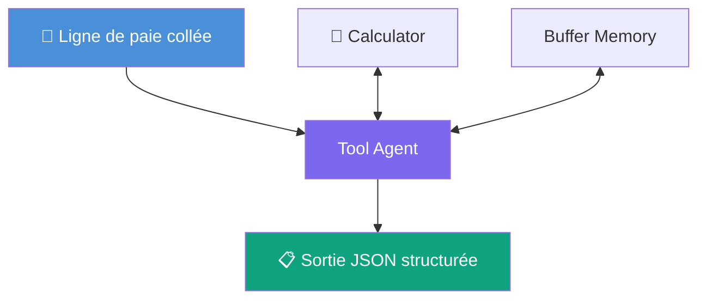

# J7 — Fiche projet B : Vérificateur de cohérence de paie (Agent)

**Public** : groupe de projet J7 — Product Build.
**Durée cadrée** : 3h de prototypage max.
**Type de flow** : Chatflow (Agent), sur le modèle de J4-Agent-Simple.

---

## Contexte métier

Avant toute analyse poussée, un auditeur vérifie des cohérences arithmétiques simples sur une ligne de paie : est-ce que les composantes d'une base de cotisation s'additionnent correctement ? Est-ce que le net à payer est cohérent avec le brut et les retenues ? Ce sont des contrôles rapides, répétés sur chaque anomalie signalée.

## Objectif

Construire un agent qui, à partir d'une ligne de paie fournie dans le chat (copiée-collée par l'utilisateur), recalcule deux cohérences et répond dans un format structuré, exploitable (pas un paragraphe de prose).

## Données

Une ligne de paie type contient (entre autres) : `Brut`, `Base cotisations`, `Tranche A`, `Tranche B`, `Tranche C`, `Net Avant PAS`, `Montant PAS`, `Net à payer`. L'utilisateur colle une ligne (ou les valeurs pertinentes) directement dans le message — pas de fichier à charger pour ce projet.

## Règles de cohérence à implémenter

Ces formules ont été vérifiées sur les 7217 lignes réelles disponibles (pas la formule DSN théorique — les colonnes du fichier Deloitte ne suivent pas exactement ce schéma) :

| # | Règle                                                                                                                                                                   | Tolérance observée                                |
| - | ------------------------------------------------------------------------------------------------------------------------------------------------------------------------ | --------------------------------------------------- |
| 1 | `Tranche A + Tranche B + Tranche C ≈ Base cotisations` (la `Tranche 2`, colonne Agirc-Arrco, n'est **pas** additive avec A/B/C — parallèle, pas cumulative) | écart médian 0,002 €, 86,5 % des lignes sous 1 % |
| 2 | `Net Avant PAS − Montant PAS ≈ Net à payer`                                                                                                                         | écart médian 0,002 €, 100 % des lignes sous 1 € |

## Architecture cible



## Étapes de construction

1. Dupliquer le pattern de J4-Agent-Simple : **Tool Agent** + **Calculator** + **Buffer Memory** + **Anthropic Claude** (credential déjà configurée).
2. Rédiger un prompt système en français qui :
   - explique les deux règles de cohérence ci-dessus,
   - impose une sortie strictement au format JSON, tableau d'objets `{champ, valeur_observee, valeur_attendue, ecart, severite}` (`severite` = `OK` ou `ALERTE`),
   - interdit toute réponse hors de ce format.
3. Tester avec une ligne réelle "propre" (une ligne quelconque d'un des 15 CSV) : vérifier que le résultat est `OK` sur les deux règles.
4. Tester avec une ligne où les tranches sont mal ventilées (ou modifiée à la main pour créer un écart volontaire) : vérifier que l'agent détecte bien l'`ALERTE` avec le bon écart chiffré.

## Cas de test (pour mesurer le succès)

Deux lignes réelles extraites du jeu de données, à coller telles quelles dans le chat pour valider la construction du groupe.

**Test 1 — Ligne saine (doit ressortir `OK` sur les deux règles)**

> Matricule 660, Jessi Connealy (Brasserie Dorée) — Brut : 5293,54 ; Base cotisations : 429,11 ; Tranche A : 429,11 ; Tranche B : (vide) ; Tranche C : (vide) ; Net Avant PAS : 4881,206 ; Montant PAS : (vide) ; Net à payer : 4881,21

Résultat attendu :

```json
[
  {"champ": "Tranche A+B+C vs Base cotisations", "valeur_observee": 429.11, "valeur_attendue": 429.11, "ecart": 0.0, "severite": "OK"},
  {"champ": "Net Avant PAS - Montant PAS vs Net à payer", "valeur_observee": 4881.206, "valeur_attendue": 4881.21, "ecart": 0.004, "severite": "OK"}
]
```

**Test 2 — Ligne avec anomalie réelle (doit ressortir `ALERTE` sur la règle 1)**

> Matricule 1190, Cass Sprott (Maison Favreau) — Brut : 13147,56 ; Base cotisations : 13147,563 ; Tranche A : 835,65 ; Tranche B : 2506,944 ; Tranche C : 3342,592 ; Net Avant PAS : 11240,097 ; Montant PAS : (vide) ; Net à payer : 11240,10

Résultat attendu (calcul de référence : 835,65 + 2506,944 + 3342,592 = 6685,186, écart de 6462,377 € soit **49,2 %** par rapport à la base cotisations 13147,563) :

```json
[
  {"champ": "Tranche A+B+C vs Base cotisations", "valeur_observee": 6685.186, "valeur_attendue": 13147.563, "ecart": 6462.377, "severite": "ALERTE"},
  {"champ": "Net Avant PAS - Montant PAS vs Net à payer", "valeur_observee": 11240.097, "valeur_attendue": 11240.10, "ecart": 0.003, "severite": "OK"}
]
```

✅ Succès si : le groupe obtient `ALERTE` uniquement sur la règle 1 (la règle 2 reste `OK` sur cette ligne — ce n'est pas une ligne totalement corrompue, seulement mal ventilée entre tranches), avec un écart chiffré proche de 6462 € / 49 %.
❌ Échec si : les deux règles ressortent `OK` (le calcul de la règle 1 n'est pas fait correctement), ou si l'écart est ignoré/arrondi sans être exploitable.

## Référence formateur

Flow de démonstration fonctionnel : **`J7-Projet-B-Verificateur-Coherence-Paie`**. Testé sur une ligne saine (résultat `OK` sur les deux règles, écarts de l'ordre du millième d'euro) et une ligne anormale (tranches mal ventilées, `ALERTE` détectée avec écart ~49 % sur la règle 1).

## Point de vigilance pour le groupe

Ne pas partir de la formule DSN "manuel" classique sans la confronter aux données réelles : sur ce jeu de données, une formule de cohérence "théorique" mal calibrée génère beaucoup de faux positifs. Le groupe doit vérifier sa règle sur plusieurs lignes réelles avant de la figer dans le prompt.

## Grille d'évaluation (rappel du cadrage J7)

- **Fiabilité des réponses** : le calcul est-il exact ? La `severite` reflète-t-elle un vrai écart ou un artefact d'arrondi ?
- **Conformité RGPD** : le nom du salarié doit-il apparaître dans la sortie JSON, ou seulement le matricule ?
- **Limites identifiées** : que se passe-t-il si l'utilisateur colle une ligne incomplète (colonnes manquantes) ? L'agent doit-il refuser ou halluciner une valeur manquante ?

