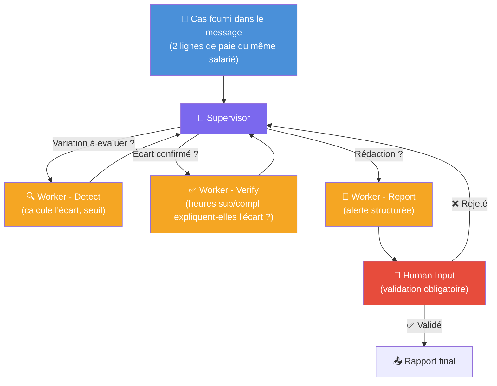

# J7 — Fiche projet C : Détection d'anomalie multi-agent (Agentflow)

**Public** : groupe de projet J7 — Product Build. Recommandé pour un groupe à l'aise avec le pattern J6.
**Durée cadrée** : 3h de prototypage max.
**Type de flow** : Agentflow (multi-agent supervisé), sur le modèle de J6.

---

## Contexte métier

Une variation forte du salaire brut d'un mois sur l'autre est un signal d'audit classique — mais elle n'est pas automatiquement une anomalie : elle peut être justifiée par des heures supplémentaires ou complémentaires. Un auditeur ne se contente jamais du premier signal : il vérifie, contextualise, puis rédige une alerte seulement si elle tient.

## Objectif

Reproduire le pattern superviseur/workers de J6 sur ce cas précis : détection → vérification → rédaction → validation humaine obligatoire avant clôture.

## Architecture cible

## Données

Pour tester, fournir dans le message deux lignes du même `Matricule` sur deux périodes (ex. deux lignes du même salarié à des mois différents dans un des 15 CSV), avec `Brut`, `Total heures`, `Heures suppl.`, `Heures compl.`.

## Règle de détection

- Écart de `Brut` > 15 % d'un mois sur l'autre → à investiguer (Worker Detect).
- Le Worker Verify compare la variation de `Total heures + Heures suppl. + Heures compl.` à la variation de `Brut` : si la variation d'heures n'explique qu'une petite fraction de la variation de brut, l'écart est jugé **non justifié**.

## Étapes de construction

1. Partir d'un export/clone du flow J6 (Start → Supervisor → Condition → Workers → Loop → Human Input) plutôt que de tout reconstruire à la main — la mécanique de boucle est la partie la plus fragile.
2. Renommer et adapter les 3 workers : `Worker-Detect`, `Worker-Verify`, `Worker-Report`, avec un prompt propre à chacun (voir rôles ci-dessus). Ajouter l'outil **Calculator** aux workers Detect et Verify.
3. Adapter le prompt du Supervisor au nouveau contexte (variation de brut au lieu de contrôle documentaire/URSSAF).
4. **Reproduire impérativement le contournement du bug moteur Flowise 3.1.2** (cf. README, section "Limite moteur Flowise 3.1.2 — J6") :
   - `Persist State` = activé sur le nœud **Start**.
   - Le nœud **Loop** doit remettre `next` et `final_report` à vide après un rejet humain (`Update State`).
   - Le prompt du Supervisor doit interdire explicitement de choisir `FINISH` juste après un rejet récent.
   Sans ces trois réglages, le flow peut boucler indéfiniment après un `Human Input` — c'est un bug documenté du moteur, pas une erreur de conception du groupe.
5. Tester avec un cas de variation forte et non justifiée : vérifier que le flow s'arrête bien à **Human Input** (état `STOPPED`) avant de conclure.

## Cas de test (pour mesurer le succès)

Deux cas réels extraits du jeu de données, à fournir tels quels dans le message pour valider la construction du groupe.

**Test 1 — Variation non justifiée (doit être signalée en `ALERTE`)**

> Matricule 690, Sigmund Statefield (Brasserie Dorée)
> - Période 1 (2025-04-02 → 2025-07-31) : Brut = 3492,93 € ; Total heures = 737,88 ; Heures suppl. = 75,669
> - Période 2 (2025-09-01 → …) : Brut = 6352,37 € ; Total heures = 743,60 ; Heures suppl. = 76,252

Calcul de référence : écart de Brut = **+81,9 %** ; écart d'heures (Total + suppl. + compl.) = **+0,8 %** seulement.

✅ Succès si : le Worker Detect déclenche (écart > 15 %), le Worker Verify conclut **non justifié** (l'écart d'heures de 0,8 % n'explique presque rien de la hausse de 81,9 %), le flow s'arrête à **Human Input** avant de produire un rapport final.
❌ Échec si : le flow conclut "justifié", ou termine (`FINISH`) sans passer par Human Input.

**Test 2 — Variation justifiée (ne doit pas être signalée comme anomalie, ou doit l'être avec la nuance correcte)**

> Matricule 631, Kirk Brounsell (Bonne Fourchette)
> - Période 1 (2025-06-01 → 2025-06-30) : Brut = 2131,67 € ; Total heures = 136,213
> - Période 2 (2025-07-01 → 2025-07-31) : Brut = 3408,70 € ; Total heures = 220,517

Calcul de référence : écart de Brut = **+59,9 %** ; écart d'heures = **+61,9 %** — quasi proportionnel.

✅ Succès si : le Worker Detect déclenche toujours (écart > 15 %), mais le Worker Verify conclut **justifié** (la variation d'heures explique la quasi-totalité de la variation de brut).
❌ Échec si : le flow classe ce cas comme anomalie non justifiée sans nuance — c'est le test qui distingue un vrai Worker Verify d'un simple seuil sur le brut.

## Référence formateur

Flow de démonstration fonctionnel : **`J7-Projet-C-Detection-Anomalie-Multi-Agent`**. Testé avec un cas Brut 2200 € → 3900 € (+77 %) et une variation d'heures de +2,2 % seulement : le Worker Verify conclut correctement "non justifié" (la variation d'heures n'explique que ~5,5 % de la hausse), et le flow s'arrête bien à Human Input avant de produire le rapport final.

## Point de vigilance pour le groupe

C'est le projet le plus ambitieux des trois — à réserver à un groupe qui a bien compris l'architecture J6 pendant la journée 6. Le risque principal en 3h n'est pas la logique métier (simple), mais la mécanique de boucle Flowise si le contournement du point 4 est oublié ou mal reproduit.

## Grille d'évaluation (rappel du cadrage J7)

- **Fiabilité des réponses** : le calcul de variation et la conclusion "justifié / non justifié" sont-ils corrects sur plusieurs cas testés (y compris un cas où la variation *est* justifiée) ?
- **Conformité RGPD** : le rapport final doit-il contenir le nom du salarié ou seulement le matricule ?
- **Limites identifiées** : le groupe explique-t-il pourquoi la validation humaine est un point de contrôle obligatoire ici (et pas juste une formalité) ?
