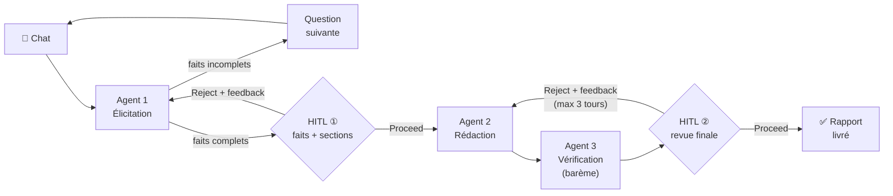

# J7 — Note d'utilisation : Générateur de rapport normé SFDR (Agentflow)

**Deux flows importés automatiquement** :

| Flow | Mapping faits → sections | Norme | Modèles |
|---|---|---|---|
| `J7 - Rapport Norme SFDR` (v0) | LLM (norme en contexte, ~12k tokens × 3 agents) | texte complet injecté | Claude partout |
| `J7 - Rapport Norme SFDR v1 (durci)` | **table de décision déterministe** (nœud Custom Function, zéro LLM) | `sfdr-regles.json` versionné | gpt-4o-mini (élicitation, récap, vérif) + Claude (rédaction) |

**Résultat du jeu d'éval** (7 cas dont 1 cas d'incohérence, `init/eval-rapport-norme.py`, mesuré le 2026-07-10 après relecture expert) : v1 rappel 100 % / précision 100 % + incohérence PAI/taille détectée et signalée. v0 : varie d'un run à l'autre (98 %/95 % sur le dernier run — sections manquantes ou en excès différentes à chaque exécution, incohérence non détectée) — illustration concrète de la reproductibilité statistique vs par construction.

**Type** : Agentflow V2 — 3 agents séquentiels + 2 validations humaines (HITL) + boucle de correction bornée.
**Norme** : règlement (UE) 2019/2088 « SFDR » (publication d'informations de durabilité dans les services financiers) — open source EUR-Lex.

---

## Ce que fait le flow

À partir d'un dialogue en chat, le flow :

1. **Élicite les faits** (Agent 1) — 5 faits à collecter, une question à la fois :
   type d'acteur, plus de 500 salariés, prise en compte des PAI, type de produit (art. 8 / art. 9 / standard), indice de référence désigné.
2. **Déduit les sections applicables** du rapport (catalogue S-01 à S-09, chaque section justifiée par son article).
3. **HITL ①** — vous validez faits + périmètre de sections avant toute rédaction.
4. **Rédige le brouillon** (Agent 2), section par section ; chaque affirmation est rattachée à un article `(art. X)` ou à un fait déclaré `(fait : …)` ; ce qui ne peut pas être rempli ressort en `[A COMPLETER PAR L'AUDITEUR]`.
5. **Vérifie selon un barème explicite** (Agent 3) : complétude des sections, traçabilité des affirmations, cohérence interne, périmètre. Verdict `CONFORME` / `A CORRIGER`, annoté point par point.
6. **HITL ②** — vous relisez le rapport annoté. Toute correction repasse par la vérification (rebouclage, plafonné à 3 tours).



---

## Mode d'emploi (dans l'UI Flowise)

1. Ouvrir le flow `J7 - Rapport Norme SFDR` et lancer le chat (icône 💬).
2. Décrire le cas. Deux styles possibles :
   - **Guidé** : « Je dois produire un rapport SFDR pour un assureur. » → l'agent pose ses questions une par une.
   - **Direct** : donner tous les faits d'un coup — exemple à copier-coller :
     > Rapport SFDR pour un gestionnaire d'actifs de 620 salariés, PAI pris en compte, produit article 8 sans indice de référence.
3. **HITL ①** : le récapitulatif s'affiche avec deux boutons.
   - **Proceed** → la rédaction démarre.
   - **Reject** → une zone de feedback s'ouvre : écrire précisément le fait à corriger ou la section à ajouter/retirer (ex. « le produit est en réalité article 9 avec indice désigné »). L'élicitation reprend en tenant compte du feedback.
4. La rédaction puis la vérification s'enchaînent automatiquement (compter 1 à 2 minutes — la norme complète est dans le contexte).
5. **HITL ②** : le rapport annoté par le vérificateur s'affiche.
   - **Reject** + feedback → Agent 2 applique la correction, Agent 3 re-vérifie **en ciblant ce qui a changé**, retour au HITL ②. Plafond : 3 tours, puis le flow rend la main avec le dernier brouillon.
   - **Proceed** → livraison du rapport final.

**Important** : au Reject, donnez toujours un feedback écrit — c'est lui qui pilote la correction. Un Reject vide ne dit pas quoi corriger.

## Cas de test (résultat attendu)

Avec l'exemple « 620 salariés, PAI oui, art. 8, sans indice » :

- Sections retenues : **S-01 à S-06, S-08, S-09** — et pas S-07 (réservé aux produits art. 9).
- S-02 doit ressortir en **déclaration PAI obligatoire** (pas d'option « explain ») : plus de 500 salariés (art. 4, par. 3).
- Le rapport final contient 8 sections, chacune avec ses références d'articles.

Pour tester le rebouclage : au HITL ②, rejeter avec par exemple « Supprime toute référence au règlement délégué 2022/1288 » et vérifier que la re-vérification mentionne le rebouclage et ne contrôle que la modification.

---

## Utilisation par API (optionnel)

```bash
# Tour de chat normal
curl -X POST http://localhost:3000/api/v1/prediction/<FLOW_ID> \
  -H "Authorization: Bearer <API_KEY>" -H "Content-Type: application/json" \
  -d '{"question":"Rapport SFDR pour ...","overrideConfig":{"sessionId":"ma-session"}}'

# Reprise après une pause HITL (Proceed ou Reject)
curl -X POST http://localhost:3000/api/v1/prediction/<FLOW_ID> \
  -H "Authorization: Bearer <API_KEY>" -H "Content-Type: application/json" \
  -d '{"question":"Proceed","chatId":"ma-session",
       "humanInput":{"type":"proceed","startNodeId":"humanInputAgentflow_0"},
       "overrideConfig":{"sessionId":"ma-session"}}'
```

Points durs appris en construisant le flow (à respecter si vous modifiez un HITL) :

- `question` ne doit **jamais** être vide (erreur 400 Anthropic sinon).
- `startNodeId` = id du nœud Human Input en pause (`humanInputAgentflow_0` pour le HITL ①, `humanInputAgentflow_1` pour le ②).
- Les branches Proceed/Reject d'un nœud Human Input se câblent avec les handles **`-output-0` / `-output-1`** (jamais `-output-proceed`/`-output-reject`, sinon les deux branches s'exécutent en même temps).
- Une reprise ratée passe l'exécution en état `ERROR` : repartir sur un `sessionId` neuf.

## La v1 durcie : ce qui change

Le mode d'emploi ci-dessus vaut pour les deux flows (mêmes HITL, mêmes boutons, même rebouclage). Différences v1 :

- **Moteur de règles déterministe** : le nœud « Moteur de regles » (Custom Function) évalue la table de décision de `data/normes/sfdr-regles.json` (11 règles R-01…R-10 + R-06b, 9 sections S-01…S-09, arbres et/ou de conditions). À faits identiques, sections identiques — traçable : le récap affiche `S-06 déclenchée par R-07 (art. 8)`.
- **La complétude des faits est calculée par le moteur, pas par le LLM** : un fait n'est acquis que s'il porte une valeur canonique du vocabulaire. Fait manquant ou invalide → question ciblée, jamais de rédaction sur des faits incomplets (échec visible).
- **Contrôles de cohérence entre faits** (`coherences` du JSON) : ex. K-01 — un acteur > 500 salariés déclarant ne pas prendre en compte les PAI (contradiction avec l'art. 4 §3-4) est bloqué avec un message explicite, au lieu d'un rapport bâti sur des faits contradictoires.
- **Le récap du HITL ① est généré par le moteur** (markdown construit dans le code, recopié tel quel) : les tentatives de le faire produire par gpt-4o-mini omettaient ou intervertissaient des sections — on ne demande pas à un LLM de reproduire une liste déterministe.
- **La norme n'est plus dans le contexte** : chaque agent ne reçoit que le nécessaire (vocabulaire pour l'élicitation, gabarits + points obligatoires des seules sections retenues pour la rédaction et la vérification). Contexte ÷ ~15.
- **Modèles panachés** : élicitation, récap et vérification sur `gpt-4o-mini` (gateway OpenAI Liora) ; la rédaction — le livrable — reste sur Claude.
- **Source de vérité** : `sfdr-regles.json` porte un `statut: propose_llm` par règle — la relecture expert (étape E4 du PRD §4.1) reste à faire pour passer les règles en `valide_expert`.

## Limites connues

- **HITL = Proceed/Reject + feedback texte** : pas d'édition champ par champ des faits ni de cases à cocher par section (limite du nœud Flowise) ; la correction passe par le feedback écrit, qui reboucle sur l'élicitation.
- **Rédaction en un appel** (toutes les sections d'un coup), pas une itération par section.
- Sortie en texte structuré (Markdown), pas de mise en page Word/PDF.
- v0 uniquement : mapping LLM → reproductibilité statistique (98 % de précision mesurée). La v1 supprime cette limite.

## Rejouer le jeu d'éval

```bash
python3 init/eval-rapport-norme.py <API_KEY> <FLOW_ID_V0> <FLOW_ID_V1>
```

6 cas connus (faits → sections attendues), extraction des `S-XX` du récap HITL ①, précision/rappel par flow. À enrichir jusqu'à 10-15 cas avec l'expert (PRD §10).

## Changer de norme

- **v0** : déposer le texte des articles dans `data/normes/`, adapter `init/build-j7-rapport-norme.py` (vocabulaire, catalogue, chemin), régénérer.
- **v1** : refaire la phase build (PRD §4.1) → produire un nouveau `<norme>-regles.json` (vocabulaire, règles, sections), le faire relire par l'expert, pointer `init/build-j7-rapport-norme-v1.py` dessus, régénérer.
- Dans les deux cas : `python3 init/build-j7-rapport-norme[-v1].py` puis `docker compose run --rm init`.

## Fichiers du projet

| Fichier | Rôle |
|---|---|
| `init/flows/J7-Rapport-Norme.json` | Flow v0 (norme en contexte, mapping LLM) |
| `init/flows/J7-Rapport-Norme-v1.json` | Flow v1 durci (moteur déterministe) |
| `init/build-j7-rapport-norme.py` | Générateur du flow v0 |
| `init/build-j7-rapport-norme-v1.py` | Générateur du flow v1 (embarque sfdr-regles.json dans le nœud moteur) |
| `init/eval-rapport-norme.py` | Jeu d'évaluation (6 cas, précision/rappel v0 vs v1) |
| `data/normes/sfdr-regles.json` | **Table de décision versionnée** : vocabulaire, règles, sections (source de vérité v1) |
| `data/normes/sfdr-2019-2088-fr.pdf` | La norme source (EUR-Lex) |
| `data/normes/sfdr-articles-fr.txt` | Texte des articles (utilisé par la v0) |
